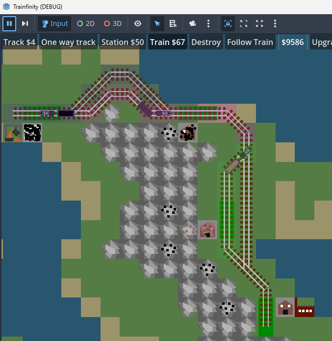

# Trainfinity

## Features
- Stations built next to producers will be filled over time depending on the resource:
	- Mines produce coal or iron
	- Forests produce wood
	- Cities produce mail
- Stations built next to consumers will accept resources:
	- Factories accept wood and steel
	- Steelworks accept coal and iron and produce steel
	- Cities accept mail
- Prices increase with the number of objects built
- Trains can turn around when stopped at platforms but not elsewhere
- Trains avoid oncoming trains by choosing sidetracks when available

## Controls
- To build track, select Track and either click start and then end positions, or drag from start
  position to end position
- Select Station and click an empty location (preferrably next to a resource) to build a station
- Platforms are automatically built on track next to stations
- Select Train and click two platforms in succession to create a train and a route.
  - Train length is equal to the shortest platform length
- Select Destroy and either click on a location or drag to select an area to destroy
- Modes can also be selected with the number keys (1 to build track etc)

## Credits

### Music

- [Next to you - Joth](https://opengameart.org/content/next-to-you)

### Audio

- [Coin Splash - LordTomorrow](https://opengameart.org/content/coin-splash)

## TODO

- Show ghost track arrow
- Select an industry to show what it is adding and producing
- Select a train to show destinations
- Remove the need of so many different groups, like resource_exchangers
  etc
- costs are very harsh, money runs out quickly and rail etc is 
  expensive. Increase pay for deliveries?
- more sound effects and music
- disallow building out of bounds
- expand building area
- different prices and production rate for different goods
- cities consume only OTHER cities' mail
- help menu showing the controls
- train should mark the tile it wants to go to when it cannot find path
  - either when you select the train, or it can create a red line to the taget
- change graphics for end of platform, so it can't look like two stations are one
  large platform
- producers/consumers of the same resource not less apart than the longest station length (5 tiles?)
- show ghost platforms when building station
- show ghost platforms when building track
- heavier trains should have slower acceleration
- change train paths when changing length of starting or ending station
- saving the game
  - will be useful for debugging as well, since can load into a certain state

### Issues

- Looks like there might still be a problem with trains picking up mail that they
  just left at a station
- Trains stop and wait at intersections sometimes, but it's better if they stop one space before
  so that other trains can pass by the intersection. 
  
- Changing a platform length to 1 puts wagon on top of train engine
  - Test also reducing platform length to less than train length to confirm that this
	has the same effect
- Wagons fill from the wrong way around again
- How to prevent the situation when, if a mine and the factory aligns, just create one
  long station that connects them both?
	1. In map generation, make sure that related resources aren't spawning less than X
	   tiles from each other, where X is the maximum platform length
	   - puts restrictions on map generation
	   + this might be wanted anyway; regardless of solution, not much fun if source
		 and target are too close to each other. Also unrealistic to even consider
		 transferring wares via train if that is the case.
- If there is a platform max length, 
  1. what to do if placing a station just outside the station max length?
	1. Create a new platform there. If so, has to make sure that we visualize the end
	   of platforms.
  2. what to do if connecting two stations of length X-2 with a new rail?
	1. Extend one of them. Might lead to platforms changing length. Perhaps not a big
	   problem, try it out.
- When creating and removing rail, sometimes existing stations will be unexpectedly 
  rejigged.

### Thinking about it

- signals

### Discarded ideas

- build platforms instead of stations
  - done on create-platform-like-track branchs, had some issues; 
	turned out to be a bit fiddly for the user
- non-global bank using signals
  - Multiple nodes need to query how much money is available, so signals were not 
	practical.

### In-game upgrades
- range of stations (start with 1) - though it looks ugly when they are too far from ore
- number of trains (start with 1)
- map size
- the ability to tear down/build track on mountain
- bridges
- train loading speed
- platform max length/train max length
- expand map
- station max capacity

### Between-round upgrades
- starting everything above
- amount of ore per tile

## Z-order

Front to back. Keep all below 0, so if new scenes do not have a z order assigned,
they will always be in front.

	-100 GUI (probably not needed, always in front)
	-100 Popup (probably not needed, always in front)
	-150 TrackCreationArrow
	-200 GhostStation
	-200 GhostTrack
	-200 GhostPlatform
	-200 GhostLight
	-200 DestroyMarker

	-350 Train
	-375 Station (building)
	-400 Track (rail)
	-450 Track (sleepers)
	-600 Station (platform)
	-600 Platform
	-650 Factory
	-700 Ore
	-725 City
	-750 Wall
	-800 Water
	-850 Sand
	-900 Background
